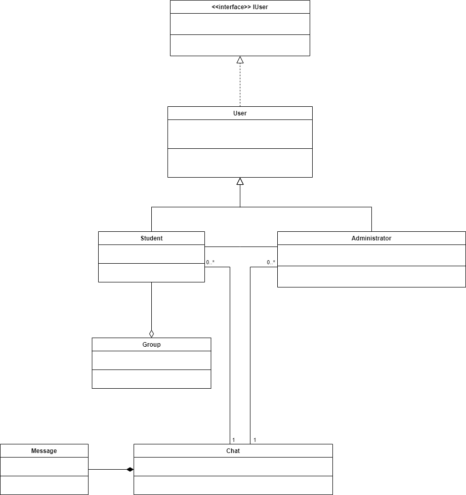
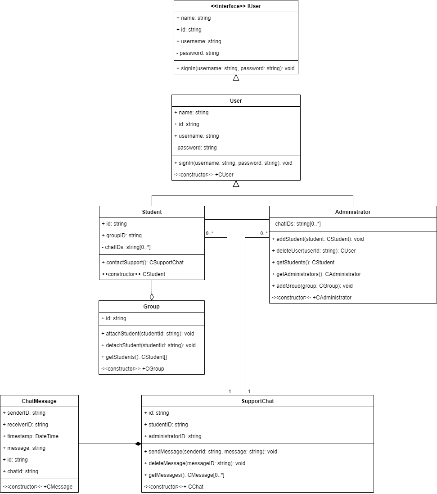

# Проєкт Віртаульне середовщие для студентів

## Опис предметної області

1.	User – користувач (базовий клас); має такі властивості name (ім’я користувача), id (унікальний ідентифікатор), username (унікальне ім’я користувача), password (пароль користувача). Може авторизуватись (містить метод signIn). Зв’язаний з всіма спеціалізованими сутностями (дочірними класами).
2.	Student – студент, складова сутності Group (відношення частина – ціле). Є спеціалізованою сутністю User (походить від класу User); має такі властивості: id (ідентифікатор студента), groupID (ідентифікатор групи), chatIDs (перелік ідентифікаторів доступних чатів). Може попросити про допомогу (метод contactSupport). Зв’язаний з сутністю Адміністратор, Чат.
3.	Administrator – адміністратор. Є спеціалізованою сутністю User (походить від класу User); має такі властивості: chatIDs (перелік ідентифікаторів доступних чатів). Може додавати до системи новго користувача (addStudent), видалити користувача (deleteStudent), отримати список студентів (getStudents), отримати список адміністраторів (getAdministrators), додати до системи нову групу (addGroup). Зв’язаний з сутністю Студент і Чат.
4.	SupportChat – чат для комунікації. Має такі властивості: id (ідентифікатор чату), studentID (ідентифікатор студента), administratorID (ідентифікатор адміністратора). Може використовуватись для відправки повідомлення (sendMessage), видалення повідомлення (deleteMessage), отримання списку повідомлень (getMessages). Зв’язаний з сутністю Студент, Адміністратор і Повідомлення.
5.	ChatMessage – повідомлення, складова частина сутності SupportChat (відношення частина - ціле).  Має такі властивості: senderID (ідентифікатор відправника), timestamp (дата відправки повідомлення), message (текст повідомлення), id (ідентифікатор повідомлення), chatId (ідентифікатор чату, до якого належить).
6.	Group – група студентів. Має такі властивості: studentIDs (список ідентифікаторів студентів які є частиною групи). Може використовуватись для додавання студента до групи (attachStudent) і видалення студента з групи (detachStudent), отримання списку студентів в групі (getStudents).

## Діаграма класів

